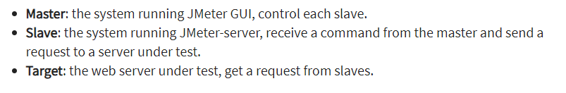
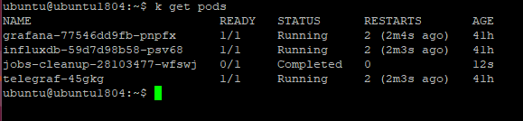
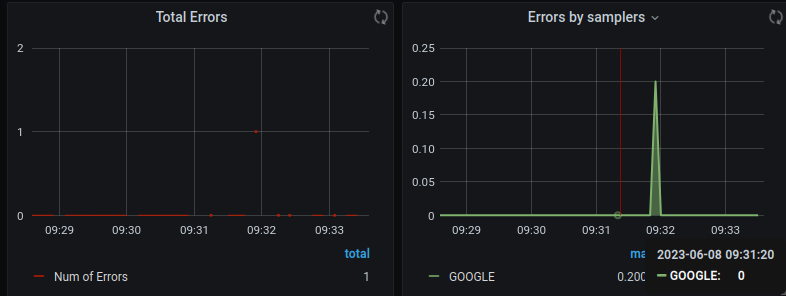
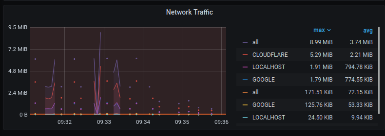

[GitHub - Rbillon59/jmeter-k8s-starterkit: Ultimate starterkit for
JMeter in Kubernetes. WIth live test reporting, JMeter monitoring,
kubernetes monitoring and mock as a
service](https://github.com/Rbillon59/jmeter-k8s-starterkit)

